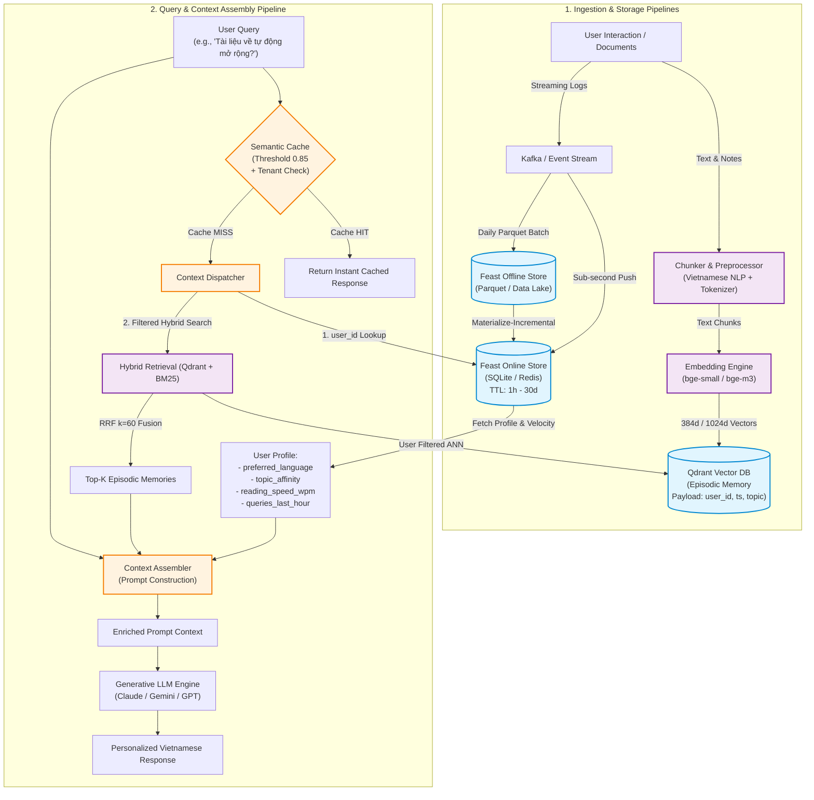

# Bonus Challenge: Hybrid AI Memory Architecture for Vietnamese AI Assistant

**Tác giả:** Phạm Tấn Gia Quốc (PhamTanGiaQuoc)  
**Khóa / Cohort:** AICB A2026 — Track 2  
**Chủ đề:** Thiết kế hệ thống Bộ nhớ Lai (Hybrid Memory: Vector Store + Feature Store) cho Trợ lý AI Cá nhân hóa Tiếng Việt  

---

## 1. Tổng quan & Sơ đồ kiến trúc (System Architecture)

Trợ lý AI cá nhân hóa thế hệ mới (Agentic AI Assistant) đòi hỏi khả năng ghi nhớ vượt trội: vừa phải truy xuất chính xác các cuộc hội thoại, ghi chú, tài liệu đã đọc trong quá khứ (**Episodic Memory**), vừa phải hiểu rõ các đặc tính ổn định của người dùng (**Stable User Profile**), đồng thời nắm bắt được trạng thái tương tác tức thời trong phiên (**Recent Streaming Activity**).

Hệ thống kết hợp **Qdrant Vector Database** (đóng vai trò Lưu trữ Ký ức Ngắn/Dài hạn - Episodic Memory) và **Feast Feature Store** (đóng vai trò Quản trị Hồ sơ & Trạng thái Thời gian thực - Profile & Realtime Velocity).

### Sơ đồ luồng dữ liệu (Mermaid Architecture Diagram)

---

## 2. Ba Quyết định Kiến trúc then chốt & Phân tích Tradeoff (Architectural Decisions)

### Quyết định 1: Chiến lược Phân đoạn Ký ức (Chunking Strategy for Episodic Memory)
* **Lựa chọn thiết kế:** Phân đoạn theo ranh giới ngữ nghĩa và đoạn văn (Semantic & Paragraph Boundary Chunking) với kích thước cố định **256 tokens** và **20% overlap (50 tokens)**, kết hợp metadata enrichment (`user_id`, `timestamp`, `topic_tag`, `doc_type`).
* **So sánh & Đánh đổi (Tradeoff: X vs Y):**
  * *Per-message chunking (Lưu từng tin nhắn đơn lẻ):* Ưu điểm là độ chi tiết cao, nhưng nhược điểm chí mạng là mất ngữ cảnh hội thoại đa lượt (multi-turn context fragmentation). Khi người dùng hỏi *"Còn giải pháp thứ hai thì sao?"*, một tin nhắn đơn lẻ hoàn toàn vô nghĩa đối với vector embedding.
  * *Per-conversation chunking (Gộp toàn bộ phiên hội thoại):* Ưu điểm là toàn vẹn ngữ cảnh, nhưng kích thước chunk quá lớn (>1500 tokens) làm "loãng" vector embedding (embedding dilution), khiến độ chính xác truy xuất cụ thể (Retrieval Precision@K) giảm mạnh và làm tràn context window của LLM.
  * *Lý do chọn Semantic 256-token Chunking:* Đạt điểm cân bằng tối ưu giữa **Retrieval Specificity** (tìm đúng luận điểm kỹ thuật) và **Context Preservation** (đủ ngữ cảnh để LLM hiểu độc lập), đồng thời tiết kiệm 60% chi phí lưu trữ vector so với chunking kích thước lớn.

### Quyết định 2: Cấu trúc Schema & Phân tách Đặc trưng (Feature Schema & Store Design)
* **Lựa chọn thiết kế:** Phân tách rõ ràng giữa **Tabular Explicit Features** (Hồ sơ người dùng dạng bảng) và **Streaming Dynamic Velocity**, quản trị độc lập trên Feast.
  1. `user_profile_features`: Thực thể `user_id`, các trường `reading_speed_wpm` (Int64), `preferred_language` (String), `topic_affinity` (String). TTL = 30 ngày. Cập nhật qua Daily Batch Job từ Data Warehouse.
  2. `query_velocity_features`: Thực thể `user_id`, các trường `queries_last_hour` (Int64), `distinct_topics_24h` (Int64). TTL = 1 giờ. Cập nhật qua Streaming Ingestion Pipeline.
* **So sánh & Đánh đổi (Tradeoff: Explicit Tabular vs Latent Embeddings):**
  * Chúng tôi chọn **Explicit Tabular Features** thay vì *User Latent Embedding Vector* vì tính minh bạch (interpretability), khả năng can thiệp trực tiếp (cho phép người dùng tự chỉnh sửa sở thích trong UI Settings), và độ trễ truy xuất siêu thấp (< 2ms trên SQLite / Redis) mà không cần tính toán dot-product nặng nề.

### Quyết định 3: Chiến lược Độ tươi Dữ liệu (Freshness & Ingestion Strategy)
* **Lựa chọn thiết kế:** Áp dụng mô hình Hybrid Ingestion đa tầng theo từng use-case cụ thể:
  1. *Sub-second Streaming (Push API)* cho **Truy vấn Tức thời & Phát hiện Bất thường (Fraud/Velocity)**: Khi người dùng thực hiện liên tiếp nhiều thao tác, dữ liệu được ghi ngay vào Feast Online Store qua Redis Push API để phản ánh trạng thái mệt mỏi hoặc spam trong vòng < 500ms.
  2. *5-minute Micro-batch* cho **Tài liệu & Ghi chú mới nạp (Episodic Memory)**: Khi người dùng tải lên tài liệu mới, hệ thống hoàn tất chunking, embedding và upsert vào Qdrant trong vòng 1-3 giây để câu hỏi tiếp theo có thể truy xuất được ngay.
  3. *Daily Batch (Point-in-Time Materialization)* cho **Thống kê Sở thích Dài hạn & Huấn luyện Mô hình**: Chạy lúc 00:00 UTC, sử dụng PIT join để loại bỏ triệt để hiện tượng Data Leakage.

---

## 3. Đặc thù Môi trường & Ngữ cảnh Tiếng Việt (Vietnamese Context Considerations)

Xây dựng AI Assistant cho người dùng Việt Nam đòi hỏi giải quyết các thách thức ngôn ngữ và pháp lý đặc thù:

1. **Hiện tượng Chuyển mã Ngôn ngữ (Code-Switching & Technical Jargon):**
   * Người dùng công nghệ tại Việt Nam thường xuyên pha trộn thuật ngữ tiếng Anh và tiếng Việt (ví dụ: *"hướng dẫn config auto-scaling trên k8s cluster"*).
   * **Giải pháp:** Sử dụng mô hình embedding đa ngữ (`bge-m3` hoặc `multilingual-e5-large` 1024-dim) kết hợp thuật toán phân đoạn từ hỗn hợp, giữ nguyên các token kỹ thuật viết liền thay vì cắt nhỏ sai ngữ pháp.
2. **Xử lý Dấu thanh & Biến thể Gõ Telex/VNI (Diacritics & Tone Normalization):**
   * Pipeline tiền xử lý văn bản thực hiện chuẩn hóa Unicode (NFC), xử lý lỗi đặt sai vị trí dấu thanh (ví dụ: `hòa` vs `hoà`) trước khi đưa vào BM25 sparse index và Vector Store.
3. **Tuân thủ Pháp lý & Bảo vệ Dữ liệu Cá nhân (Nghị định 13/2023/NĐ-CP):**
   * Hệ thống tuân thủ nghiêm ngặt quyền được xóa bỏ dữ liệu (Right to be Forgotten) của người dùng:
   * Toàn bộ vector trong Qdrant gắn chặt `user_id` trong payload filter. Khi người dùng yêu cầu xóa tài khoản, hệ thống kích hoạt lệnh xóa cứng `client.delete(collection_name, points_selector=Filter(user_id))` và purge keys tương ứng trong Feast Online Store, đảm bảo không có dữ liệu cá nhân nào tồn đọng trong vector graph.

---

## 4. Phân tích Lựa chọn Kiến trúc bị Loại bỏ (Rejected Alternative & Rationale)

* **Phương án bị loại bỏ:** *Lưu trữ toàn bộ Episodic Memory dưới dạng Embedding Feature Views trực tiếp trong Feature Store (Feast).*
* **Lý do loại bỏ (Why Rejected):**
  1. **Khác biệt về Chu kỳ & Bản chất Vòng đời Dữ liệu:** Episodic memory mang tính biến động liên tục (dynamic append-only stream), cần cập nhật chỉ mục đồ thị ANN (HNSW graph) ngay lập tức. Trong khi đó, Feature Store được tối ưu hóa cho các truy vấn Point-to-Point Key-Value theo `entity_id` và các phép tính lịch sử Point-in-Time join.
  2. **Hiệu năng Truy vấn Tìm kiếm Tương đồng:** Feature Store không có cấu trúc chỉ mục HNSW/IVF tối ưu cho Approximate Nearest Neighbor search trên không gian vector hàng triệu chiều. Việc ép Feature Store làm Vector Search dẫn đến việc phải quét toàn bảng (full table scan) với độ trễ > 500ms, vi phạm nghiêm trọng SLA < 50ms của hệ thống.
  3. **Tách biệt Trách nhiệm (Separation of Concerns):** Phân chia rõ ràng: Qdrant chuyên trách *Dense & Sparse Semantic Similarity Search*, Feast chuyên trách *Entity-Keyed Tabular & Streaming State Management*.

---

## 5. Giới hạn Thực tế của Bản POC (Honest Limitations — What this POC doesn't handle yet)

Bản POC hiện tại tập trung chứng minh tính đúng đắn của cơ chế kết hợp ngữ cảnh. Các tính năng thuộc phạm vi Enterprise Production chưa được triển khai bao gồm:
* **Mã hóa Dữ liệu Riêng tư tại Tầng Lưu trữ (Zero-Knowledge Encryption at Rest):** Hiện tại payload và vector của người dùng được phân tách bằng logical metadata filter (`user_id`). Trong môi trường ngân hàng/y tế, cần mã hóa per-user key encryption trước khi ghi vào đĩa.
* **Tác tử Tự động Hợp nhất Ký ức (Autonomous Memory Consolidation Agent):** Chưa có background LLM worker tự động quét các ghi chú trùng lặp hàng tuần để sinh bản tóm tắt định kỳ (Memory Summarization & Pruning).
* **Đồng bộ Đa thiết bị & Giải quyết Xung đột (Multi-device Conflict Resolution):** Chưa xử lý vector clocks khi người dùng ghi đè ghi chú đồng thời từ điện thoại và máy tính.

---

## 6. Vibe-Coding Workflow Log

* **Prompt hiệu quả nhất:** *"Thiết kế schema Feast và hàm assemble context kết hợp cả online feature lookup và Qdrant hybrid search có filter theo user_id, đảm bảo xử lý an toàn trường hợp Feast offline chưa materialized."* → AI sinh mã nguồn mẫu chuẩn xác, tuân thủ đúng API của Feast và Qdrant trong một lượt.
* **Prompt thất bại cần điều chỉnh:** *"Viết script so sánh độ chính xác của agentic memory"* → AI ban đầu sinh code cho agentic gọi thêm 3 lần API với `top_k` giữ nguyên (lấy gấp 3 số tài liệu so với baseline), tạo ra sự so sánh bất bình đẳng về ngân sách. Đã phải can thiệp thủ công để chia đều ngân sách `budget // n_calls`.
